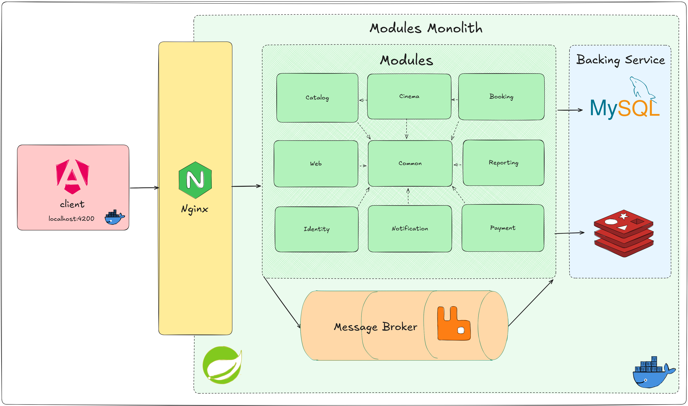

## 🏗️ System Architecture Specification

The CinePlex architecture follows a **Modular Monolith** pattern. This approach provides the logical organization of microservices—ensuring high domain isolation—while maintaining the deployment simplicity of a single runtime and unified database.

---

### 🖼️ 1. The Big Picture

The system architecture is designed as a multi-tier flow. **Nginx** serves as the primary entry point, handling SSL termination and request routing before passing traffic to the Spring Boot core.

  
  

    <i>Figure 1: System interaction flow: From Client-side interaction to Infrastructure persistence</i>
  

> [!TIP] > **Why Modular Monolith?** Choosing this pattern avoids the network latency and the overhead of managing distributed transactions common in Microservices. It keeps the codebase decoupled and clean while significantly simplifying maintenance and deployment.

---

### ⚙️ 2. Backend Organization

The backend is partitioned into independent Maven/Gradle modules under the `dawn-*` namespace.

#### The Bootstrapper: `dawn-web`

**`dawn-web`** is the heart of the system. It contains the `@SpringBootApplication` and acts as the primary bootstrapper that starts the entire Spring context. Beyond configuration, it serves as the **API Gateway Layer**, housing all REST controllers and orchestrating requests between the frontend and the underlying business modules.

#### Module Breakdown

| Module              | Domain                                                       | Technical Implementation |
| ------------------- | ------------------------------------------------------------ | ------------------------ |
| `dawn-identity`     | Auth core: JWT issuance, user security, and RBAC.            | Spring Security          |
| `dawn-catalog`      | Metadata management for movies and news articles.            | Flyway, JPA              |
| `dawn-cinema`       | Physical domain: Theaters and showtimes.                     | Flyway, JPA              |
| `dawn-booking`      | **The Logic Engine**: Reservation lifecycle and seat states. | Redis                    |
| `dawn-payment`      | Financial gateway: VNPay integration and checksum security.  | VNPay SDK                |
| `dawn-notification` | Real-time alerts and event-based signaling.                  | SSE, Mail                |
| `dawn-reporting`    | Heavy-lift worker: JasperReport PDF generation.              | RabbitMQ, Jasper         |
| `dawn-common`       | Shared Kernel: Global exceptions, base DTOs, and utils.      | Lombok                   |

---

### 📦 3. Concurrency & Booking Lifecycle

Managing high-traffic seat selection is the most critical part of the system. To prevent "Race Conditions" and "Double Booking," the system utilizes a multi-stage strategy.

#### 💺 3.1. Real-time Seat Sync (Redis)

Direct database row-locking is avoided to ensure high performance.

- **Key-Value Storage:** When a user selects a seat, the system creates a **Redis Key-Value pair** with a 15-minute expiration. This reserves the seat during the checkout window.
- **Pub/Sub Synchronization:** To keep the UI reactive, the backend leverages **Redis Pub/Sub**. Any status change (Lock/Unlock/Sold) is published to a channel. The Frontend listens to những update này qua WebSockets hoặc SSE, allowing all active users to see real-time seat changes without page refreshes.

#### 🎟️ 3.2. The 3-Phase Workflow

The booking process is strictly divided into three phases to guarantee data integrity and keep the database clean:

1.  **Phase 1: Order Initiation (Drafting)**
    An **Order ID** is generated first. This pre-order state tracks the transaction intent before bất kỳ ghế nào được giữ, ensuring every payment attempt is traceable.
2.  **Phase 2: The Soft Hold (Redis Phase)**
    Selected seats are pushed to **Redis**. They appear "Occupied" to other users but are not yet committed to the MySQL database. This prevents "failed transaction" data from cluttering the primary database tables.

3.  **Phase 3: Final Sync & Fulfillment (Post-Payment)**
    Only after the payment gateway (VNPay) confirms success does the system finalize the process:
    - **Persistence:** Data is moved from **Redis** to **MySQL** for permanent storage.
    - **Cleanup:** Temporary Redis keys are deleted to free up memory.
    - **Async Tasks:** An event is triggered via **RabbitMQ**. A background worker picks this up to generate the **JasperReport PDF** and send the confirmation **Email**. This keeps the API response time low by offloading heavy tasks to background threads.

---

### 🎨 4. Frontend & State Management

The frontend follows **Domain-Driven Design (DDD)** principles, organizing the code by features (Booking, Admin, Auth) rather than generic components.

- **NgRx:** A centralized store acts as the "Single Source of Truth." For a high-speed seat map, this is essential to prevent state desync and ensure predictable UI behavior.
- **Nginx Proxy:** Besides serving static assets, Nginx acts as a proxy to handle CORS and protect the internal API structure.

---

### 🐳 5. Infrastructure

- **Containerization:** The entire environment (App, MySQL, Redis, RabbitMQ) is orchestrated via a single `docker-compose.yml` for consistent deployments across environments.
- **Network Security:** Only Nginx is exposed to the public internet. All databases and message brokers reside within a private Docker network, accessible only by the backend modules.
- **Cloudinary:** All media assets (movie posters/articles) are stored on Cloudinary. The database only maintains URLs, keeping the storage footprint small and the backup process fast.
